# 🔄 StoreWise Application Flowcharts

> **Complete System Flow Documentation for StoreWise POS & Inventory Management**

---

## 📋 Table of Contents

1. [System Architecture Overview](#system-architecture-overview)
2. [User Authentication Flow](#user-authentication-flow)
3. [POS Transaction Flow](#pos-transaction-flow)
4. [Inventory Management Flow](#inventory-management-flow)
5. [Customer Management Workflow](#customer-management-workflow)
6. [Supplier & Purchasing Flow](#supplier--purchasing-flow)
7. [Reporting & Analytics Flow](#reporting--analytics-flow)
8. [Data Flow Diagrams](#data-flow-diagrams)
9. [Error Handling Flows](#error-handling-flows)
10. [Integration Flows](#integration-flows)

---

## 🏗️ System Architecture Overview

### **High-Level System Architecture**

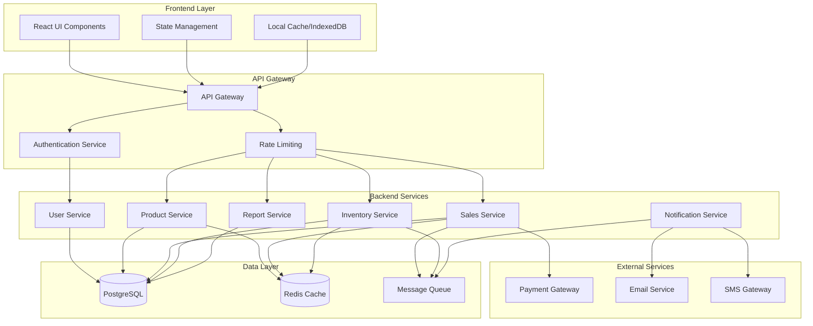
```mermaid
graph TB
    subgraph "Frontend Layer"
        UI[React UI Components]
        State[State Management]
        Cache[Local Cache/IndexedDB]
    end
    
    subgraph "API Gateway"
        Gateway[API Gateway]
        Auth[Authentication Service]
        Rate[Rate Limiting]
    end
    
    subgraph "Backend Services"
        User[User Service]
        Product[Product Service]
        Sales[Sales Service]
        Inventory[Inventory Service]
        Report[Report Service]
        Notification[Notification Service]
    end
    
    subgraph "Data Layer"
        DB[(PostgreSQL)]
        Redis[(Redis Cache)]
        Queue[Message Queue]
    end
    
    subgraph "External Services"
        Payment[Payment Gateway]
        Email[Email Service]
        SMS[SMS Gateway]
    end
    
    UI --> Gateway
    State --> Gateway
    Cache --> Gateway
    
    Gateway --> Auth
    Gateway --> Rate
    Auth --> User
    Rate --> Product
    Rate --> Sales
    Rate --> Inventory
    Rate --> Report
    
    User --> DB
    Product --> DB
    Sales --> DB
    Inventory --> DB
    Report --> DB
    
    Product --> Redis
    Sales --> Redis
    Inventory --> Redis
    
    Sales --> Queue
    Inventory --> Queue
    Notification --> Queue
    
    Sales --> Payment
    Notification --> Email
    Notification --> SMS
```

### **Component Interaction Flow**

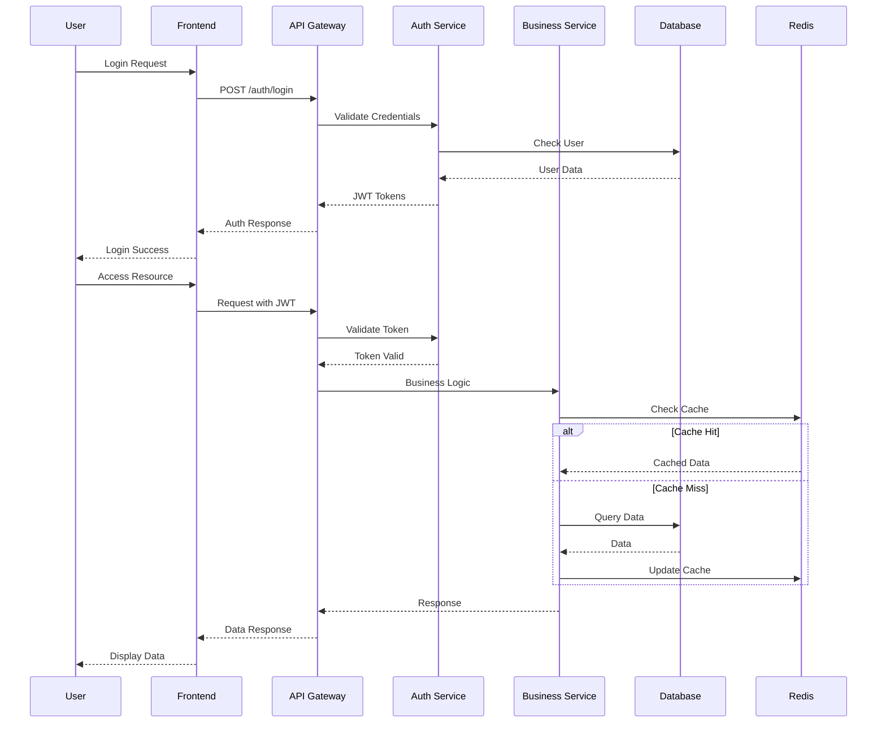
```mermaid
sequenceDiagram
    participant User as User
    participant UI as Frontend
    participant API as API Gateway
    participant Auth as Auth Service
    participant Service as Business Service
    participant DB as Database
    participant Cache as Redis
    
    User->>UI: Login Request
    UI->>API: POST /auth/login
    API->>Auth: Validate Credentials
    Auth->>DB: Check User
    DB-->>Auth: User Data
    Auth-->>API: JWT Tokens
    API-->>UI: Auth Response
    UI-->>User: Login Success
    
    User->>UI: Access Resource
    UI->>API: Request with JWT
    API->>Auth: Validate Token
    Auth-->>API: Token Valid
    API->>Service: Business Logic
    Service->>Cache: Check Cache
    alt Cache Hit
        Cache-->>Service: Cached Data
    else Cache Miss
        Service->>DB: Query Data
        DB-->>Service: Data
        Service->>Cache: Update Cache
    end
    Service-->>API: Response
    API-->>UI: Data Response
    UI-->>User: Display Data
```

---

## 🔐 User Authentication Flow

### **Login Authentication Flow**

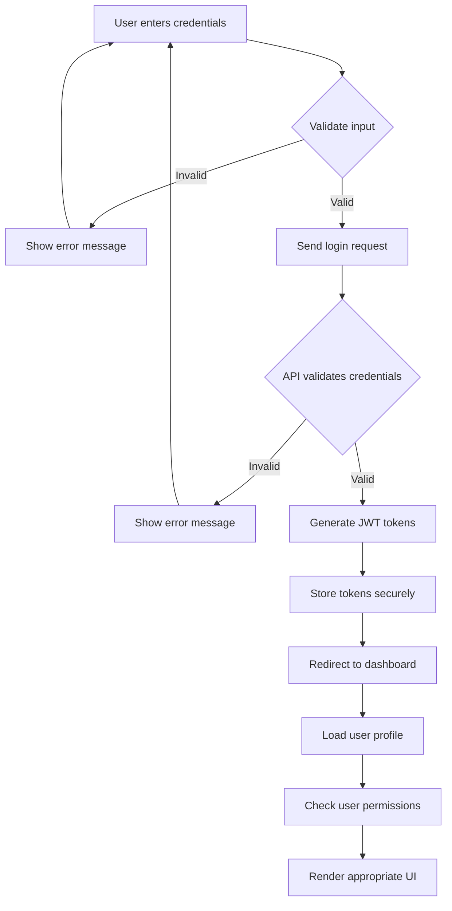
```mermaid
flowchart TD
    A[User enters credentials] --> B{Validate input}
    B -->|Invalid| C[Show error message]
    B -->|Valid| D[Send login request]
    D --> E{API validates credentials}
    E -->|Invalid| F[Show error message]
    E -->|Valid| G[Generate JWT tokens]
    G --> H[Store tokens securely]
    H --> I[Redirect to dashboard]
    I --> J[Load user profile]
    J --> K[Check user permissions]
    K --> L[Render appropriate UI]
    
    C --> A
    F --> A
```

### **Token Refresh Flow**

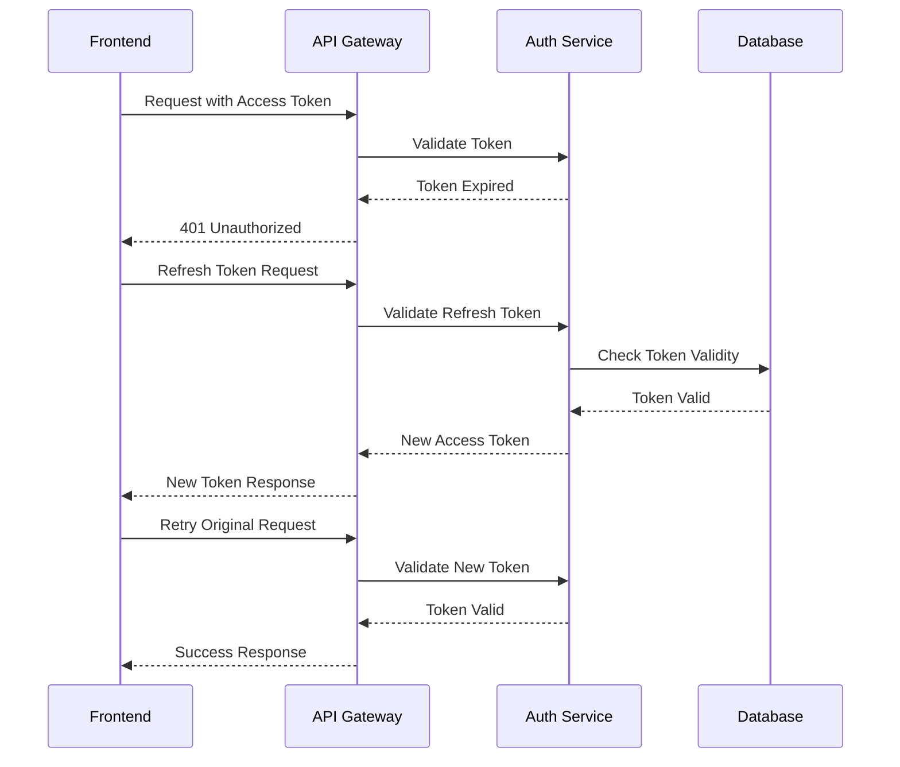
```mermaid
sequenceDiagram
    participant Client as Frontend
    participant API as API Gateway
    participant Auth as Auth Service
    participant DB as Database
    
    Client->>API: Request with Access Token
    API->>Auth: Validate Token
    Auth-->>API: Token Expired
    API-->>Client: 401 Unauthorized
    
    Client->>API: Refresh Token Request
    API->>Auth: Validate Refresh Token
    Auth->>DB: Check Token Validity
    DB-->>Auth: Token Valid
    Auth-->>API: New Access Token
    API-->>Client: New Token Response
    
    Client->>API: Retry Original Request
    API->>Auth: Validate New Token
    Auth-->>API: Token Valid
    API-->>Client: Success Response
```

### **Role-Based Access Control Flow**

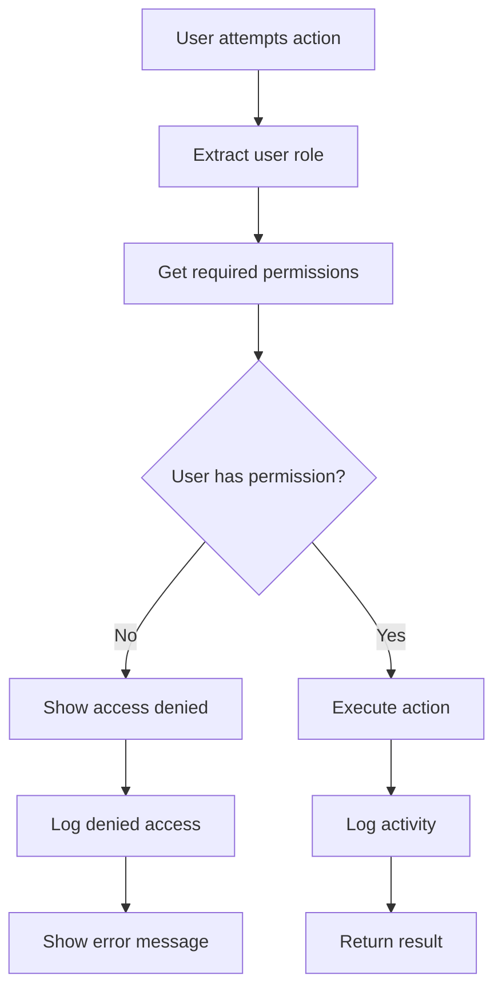
```mermaid
flowchart TD
    A[User attempts action] --> B[Extract user role]
    B --> C[Get required permissions]
    C --> D{User has permission?}
    D -->|No| E[Show access denied]
    D -->|Yes| F[Execute action]
    F --> G[Log activity]
    G --> H[Return result]
    
    E --> I[Log denied access]
    I --> J[Show error message]
```

---

## 💰 POS Transaction Flow

### **Complete POS Transaction Flow**

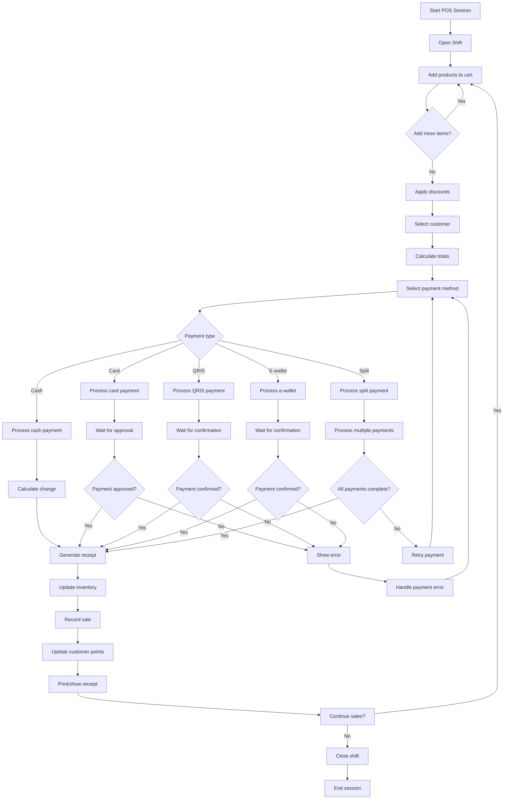
```mermaid
flowchart TD
    A[Start POS Session] --> B[Open Shift]
    B --> C[Add products to cart]
    C --> D{Add more items?}
    D -->|Yes| C
    D -->|No| E[Apply discounts]
    E --> F[Select customer]
    F --> G[Calculate totals]
    G --> H[Select payment method]
    H --> I{Payment type}
    I -->|Cash| J[Process cash payment]
    I -->|Card| K[Process card payment]
    I -->|QRIS| L[Process QRIS payment]
    I -->|E-wallet| M[Process e-wallet]
    I -->|Split| N[Process split payment]
    
    J --> O[Calculate change]
    K --> P[Wait for approval]
    L --> Q[Wait for confirmation]
    M --> R[Wait for confirmation]
    N --> S[Process multiple payments]
    
    O --> T[Generate receipt]
    P --> U{Payment approved?}
    Q --> V{Payment confirmed?}
    R --> W{Payment confirmed?}
    S --> X{All payments complete?}
    
    U -->|No| Y[Show error]
    V -->|No| Y
    W -->|No| Y
    X -->|No| Z[Retry payment]
    
    U -->|Yes| T
    V -->|Yes| T
    W -->|Yes| T
    X -->|Yes| T
    
    T --> AA[Update inventory]
    AA --> BB[Record sale]
    BB --> CC[Update customer points]
    CC --> DD[Print/show receipt]
    DD --> EE[Continue sales?]
    EE -->|Yes| C
    EE -->|No| FF[Close shift]
    
    Y --> GG[Handle payment error]
    Z --> H
    GG --> H
    FF --> HH[End session]
```

### **Product Search & Selection Flow**

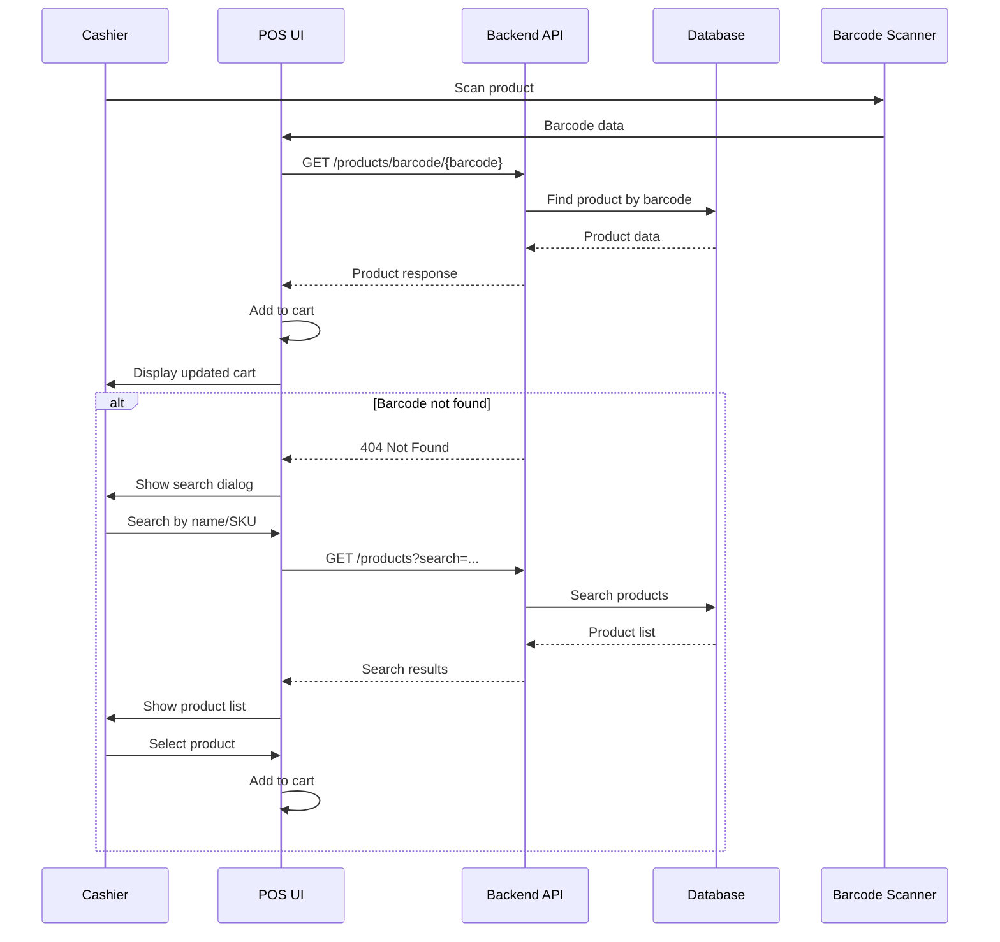
```mermaid
sequenceDiagram
    participant Cashier as Cashier
    participant UI as POS UI
    participant API as Backend API
    participant DB as Database
    participant Scanner as Barcode Scanner
    
    Cashier->>Scanner: Scan product
    Scanner->>UI: Barcode data
    UI->>API: GET /products/barcode/{barcode}
    API->>DB: Find product by barcode
    DB-->>API: Product data
    API-->>UI: Product response
    UI->>UI: Add to cart
    UI->>Cashier: Display updated cart
    
    alt Barcode not found
        API-->>UI: 404 Not Found
        UI->>Cashier: Show search dialog
        Cashier->>UI: Search by name/SKU
        UI->>API: GET /products?search=...
        API->>DB: Search products
        DB-->>API: Product list
        API-->>UI: Search results
        UI->>Cashier: Show product list
        Cashier->>UI: Select product
        UI->>UI: Add to cart
    end
```

### **Payment Processing Flow**

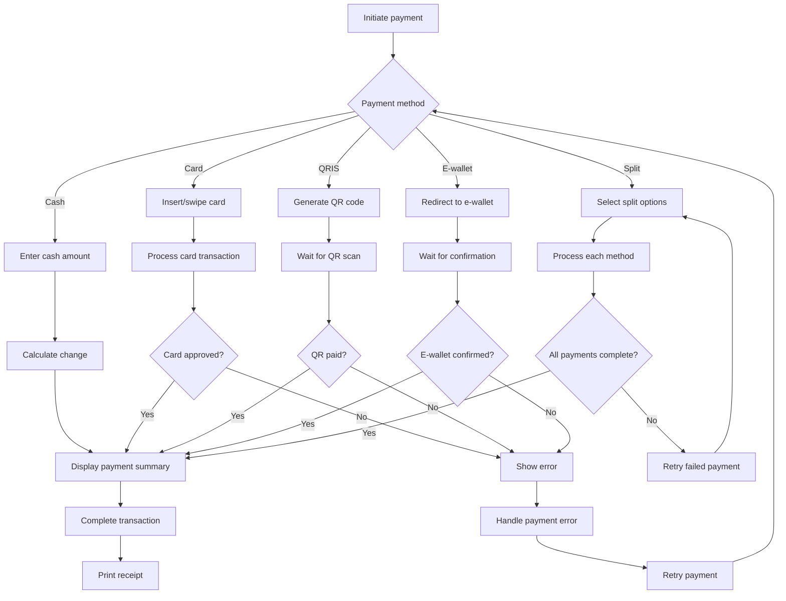
```mermaid
flowchart TD
    A[Initiate payment] --> B{Payment method}
    B -->|Cash| C[Enter cash amount]
    B -->|Card| D[Insert/swipe card]
    B -->|QRIS| E[Generate QR code]
    B -->|E-wallet| F[Redirect to e-wallet]
    B -->|Split| G[Select split options]
    
    C --> H[Calculate change]
    D --> I[Process card transaction]
    E --> J[Wait for QR scan]
    F --> K[Wait for confirmation]
    G --> L[Process each method]
    
    H --> M[Display payment summary]
    I --> N{Card approved?}
    J --> O{QR paid?}
    K --> P{E-wallet confirmed?}
    L --> Q{All payments complete?}
    
    N -->|No| R[Show error]
    O -->|No| R
    P -->|No| R
    Q -->|No| S[Retry failed payment]
    
    N -->|Yes| M
    O -->|Yes| M
    P -->|Yes| M
    Q -->|Yes| M
    
    M --> T[Complete transaction]
    R --> U[Handle payment error]
    S --> G
    T --> V[Print receipt]
    U --> W[Retry payment]
    W --> B
```

---

## 📦 Inventory Management Flow

### **Stock Management Process Flow**

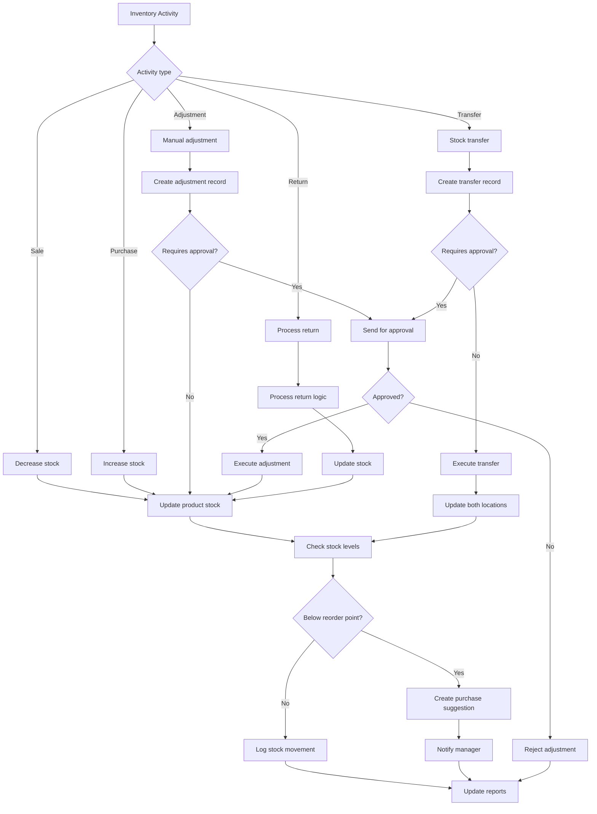
```mermaid
flowchart TD
    A[Inventory Activity] --> B{Activity type}
    B -->|Sale| C[Decrease stock]
    B -->|Purchase| D[Increase stock]
    B -->|Adjustment| E[Manual adjustment]
    B -->|Transfer| F[Stock transfer]
    B -->|Return| G[Process return]
    
    C --> H[Update product stock]
    D --> H
    E --> I[Create adjustment record]
    F --> J[Create transfer record]
    G --> K[Process return logic]
    
    I --> L{Requires approval?}
    J --> M{Requires approval?}
    K --> N[Update stock]
    
    L -->|Yes| O[Send for approval]
    L -->|No| H
    M -->|Yes| O
    M -->|No| P[Execute transfer]
    
    O --> Q{Approved?}
    Q -->|No| R[Reject adjustment]
    Q -->|Yes| S[Execute adjustment]
    
    P --> T[Update both locations]
    S --> H
    N --> H
    H --> U[Check stock levels]
    T --> U
    U --> V{Below reorder point?}
    V -->|Yes| W[Create purchase suggestion]
    V -->|No| X[Log stock movement]
    W --> Y[Notify manager]
    X --> Z[Update reports]
    Y --> Z
    R --> Z
```

### **Purchase Order Flow**

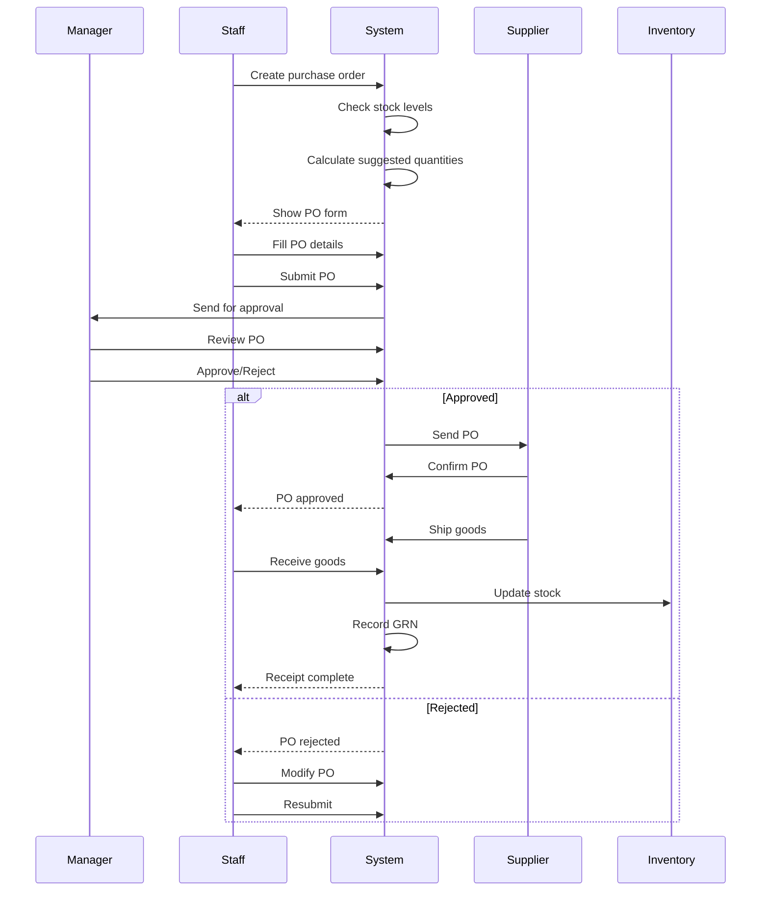
```mermaid
sequenceDiagram
    participant Manager as Manager
    participant Staff as Staff
    participant System as System
    participant Supplier as Supplier
    participant Inventory as Inventory
    
    Staff->>System: Create purchase order
    System->>System: Check stock levels
    System->>System: Calculate suggested quantities
    System-->>Staff: Show PO form
    Staff->>System: Fill PO details
    Staff->>System: Submit PO
    System->>Manager: Send for approval
    Manager->>System: Review PO
    Manager->>System: Approve/Reject
    
    alt Approved
        System->>Supplier: Send PO
        Supplier->>System: Confirm PO
        System-->>Staff: PO approved
        Supplier->>System: Ship goods
        Staff->>System: Receive goods
        System->>Inventory: Update stock
        System->>System: Record GRN
        System-->>Staff: Receipt complete
    else Rejected
        System-->>Staff: PO rejected
        Staff->>System: Modify PO
        Staff->>System: Resubmit
    end
```

### **Stock Taking Process**

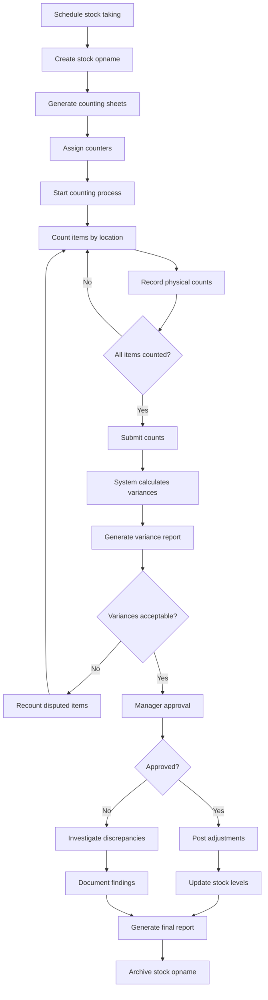
```mermaid
flowchart TD
    A[Schedule stock taking] --> B[Create stock opname]
    B --> C[Generate counting sheets]
    C --> D[Assign counters]
    D --> E[Start counting process]
    E --> F[Count items by location]
    F --> G[Record physical counts]
    G --> H{All items counted?}
    H -->|No| F
    H -->|Yes| I[Submit counts]
    I --> J[System calculates variances]
    J --> K[Generate variance report]
    K --> L{Variances acceptable?}
    L -->|No| M[Recount disputed items]
    L -->|Yes| N[Manager approval]
    M --> F
    N --> O{Approved?}
    O -->|No| P[Investigate discrepancies]
    O -->|Yes| Q[Post adjustments]
    P --> R[Document findings]
    Q --> S[Update stock levels]
    S --> T[Generate final report]
    R --> T
    T --> U[Archive stock opname]
```

---

## 👥 Customer Management Workflow

### **Customer Registration & Management Flow**

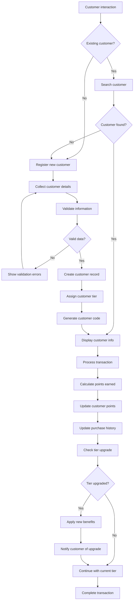
```mermaid
flowchart TD
    A[Customer interaction] --> B{Existing customer?}
    B -->|Yes| C[Search customer]
    B -->|No| D[Register new customer]
    
    C --> E{Customer found?}
    E -->|No| D
    E -->|Yes| F[Display customer info]
    
    D --> G[Collect customer details]
    G --> H[Validate information]
    H --> I{Valid data?}
    I -->|No| J[Show validation errors]
    I -->|Yes| K[Create customer record]
    K --> L[Assign customer tier]
    L --> M[Generate customer code]
    M --> F
    
    F --> N[Process transaction]
    N --> O[Calculate points earned]
    O --> P[Update customer points]
    P --> Q[Update purchase history]
    Q --> R[Check tier upgrade]
    R --> S{Tier upgraded?}
    S -->|Yes| T[Apply new benefits]
    S -->|No| U[Continue with current tier]
    T --> V[Notify customer of upgrade]
    V --> U
    U --> W[Complete transaction]
    
    J --> G
```

### **Loyalty Points System Flow**

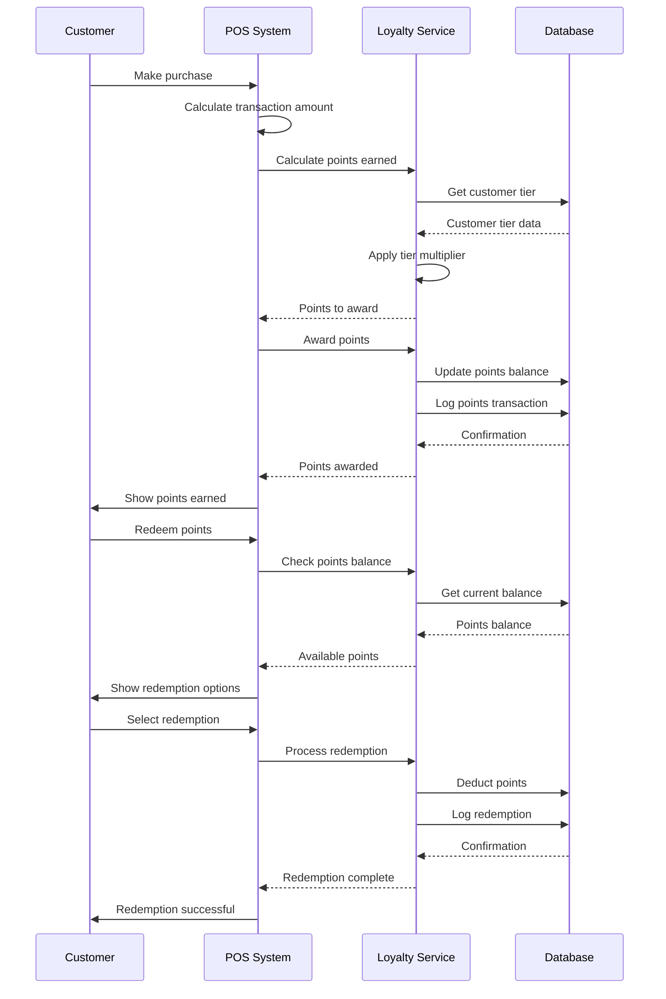
```mermaid
sequenceDiagram
    participant Customer as Customer
    participant POS as POS System
    participant Loyalty as Loyalty Service
    participant DB as Database
    
    Customer->>POS: Make purchase
    POS->>POS: Calculate transaction amount
    POS->>Loyalty: Calculate points earned
    Loyalty->>DB: Get customer tier
    DB-->>Loyalty: Customer tier data
    Loyalty->>Loyalty: Apply tier multiplier
    Loyalty-->>POS: Points to award
    POS->>Loyalty: Award points
    Loyalty->>DB: Update points balance
    Loyalty->>DB: Log points transaction
    DB-->>Loyalty: Confirmation
    Loyalty-->>POS: Points awarded
    POS->>Customer: Show points earned
    
    Customer->>POS: Redeem points
    POS->>Loyalty: Check points balance
    Loyalty->>DB: Get current balance
    DB-->>Loyalty: Points balance
    Loyalty-->>POS: Available points
    POS->>Customer: Show redemption options
    Customer->>POS: Select redemption
    POS->>Loyalty: Process redemption
    Loyalty->>DB: Deduct points
    Loyalty->>DB: Log redemption
    DB-->>Loyalty: Confirmation
    Loyalty-->>POS: Redemption complete
    POS->>Customer: Redemption successful
```

---

## 🚚 Supplier & Purchasing Flow

### **Complete Purchasing Cycle**

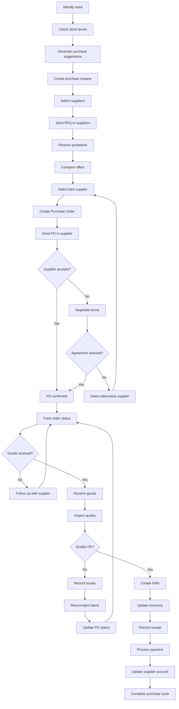
```mermaid
flowchart TD
    A[Identify need] --> B[Check stock levels]
    B --> C[Generate purchase suggestions]
    C --> D[Create purchase request]
    D --> E[Select suppliers]
    E --> F[Send RFQ to suppliers]
    F --> G[Receive quotations]
    G --> H[Compare offers]
    H --> I[Select best supplier]
    I --> J[Create Purchase Order]
    J --> K[Send PO to supplier]
    K --> L{Supplier accepts?}
    L -->|No| M[Negotiate terms]
    L -->|Yes| N[PO confirmed]
    M --> O{Agreement reached?}
    O -->|No| P[Select alternative supplier]
    O -->|Yes| N
    P --> I
    N --> Q[Track order status]
    Q --> R{Goods received?}
    R -->|No| S[Follow up with supplier]
    R -->|Yes| T[Receive goods]
    T --> U[Inspect quality]
    U --> V{Quality OK?}
    V -->|No| W[Record issues]
    V -->|Yes| X[Create GRN]
    W --> Y[Return/reject items]
    Y --> Z[Update PO status]
    X --> AA[Update inventory]
    AA --> BB[Record receipt]
    BB --> CC[Process payment]
    CC --> DD[Update supplier account]
    DD --> EE[Complete purchase cycle]
    
    S --> Q
    Z --> Q
```

### **Supplier Payment Flow**

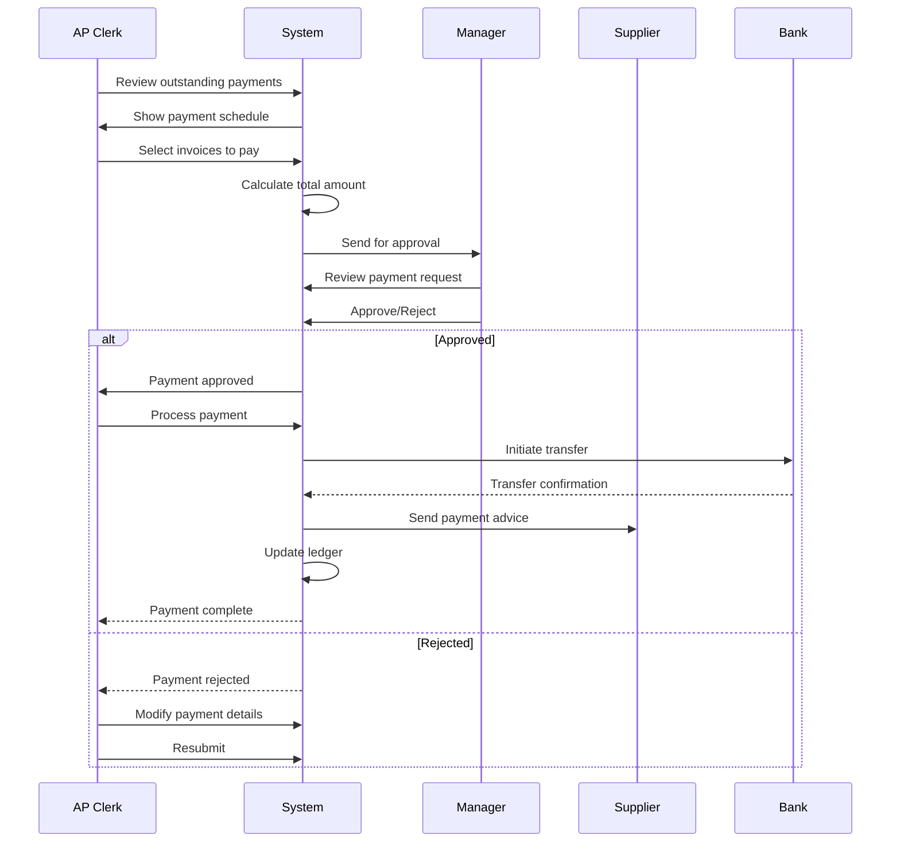
```mermaid
sequenceDiagram
    participant AP as AP Clerk
    participant System as System
    participant Manager as Manager
    participant Supplier as Supplier
    participant Bank as Bank
    
    AP->>System: Review outstanding payments
    System->>AP: Show payment schedule
    AP->>System: Select invoices to pay
    System->>System: Calculate total amount
    System->>Manager: Send for approval
    Manager->>System: Review payment request
    Manager->>System: Approve/Reject
    
    alt Approved
        System->>AP: Payment approved
        AP->>System: Process payment
        System->>Bank: Initiate transfer
        Bank-->>System: Transfer confirmation
        System->>Supplier: Send payment advice
        System->>System: Update ledger
        System-->>AP: Payment complete
    else Rejected
        System-->>AP: Payment rejected
        AP->>System: Modify payment details
        AP->>System: Resubmit
    end
```

---

## 📊 Reporting & Analytics Flow

### **Report Generation Process**

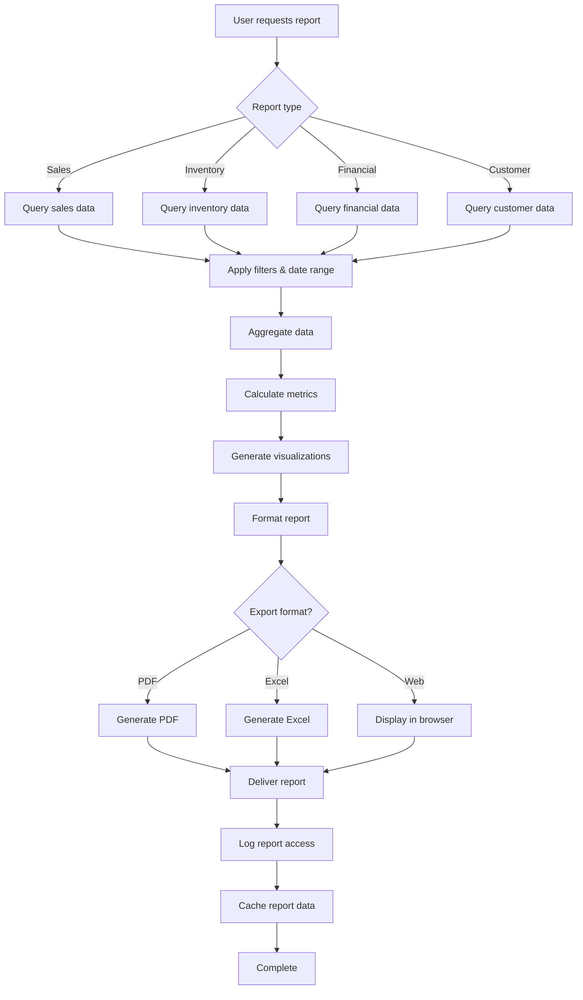
```mermaid
flowchart TD
    A[User requests report] --> B{Report type}
    B -->|Sales| C[Query sales data]
    B -->|Inventory| D[Query inventory data]
    B -->|Financial| E[Query financial data]
    B -->|Customer| F[Query customer data]
    
    C --> G[Apply filters & date range]
    D --> G
    E --> G
    F --> G
    
    G --> H[Aggregate data]
    H --> I[Calculate metrics]
    I --> J[Generate visualizations]
    J --> K[Format report]
    K --> L{Export format?}
    
    L -->|PDF| M[Generate PDF]
    L -->|Excel| N[Generate Excel]
    L -->|Web| O[Display in browser]
    
    M --> P[Deliver report]
    N --> P
    O --> P
    P --> Q[Log report access]
    Q --> R[Cache report data]
    R --> S[Complete]
```

### **Real-time Dashboard Update Flow**

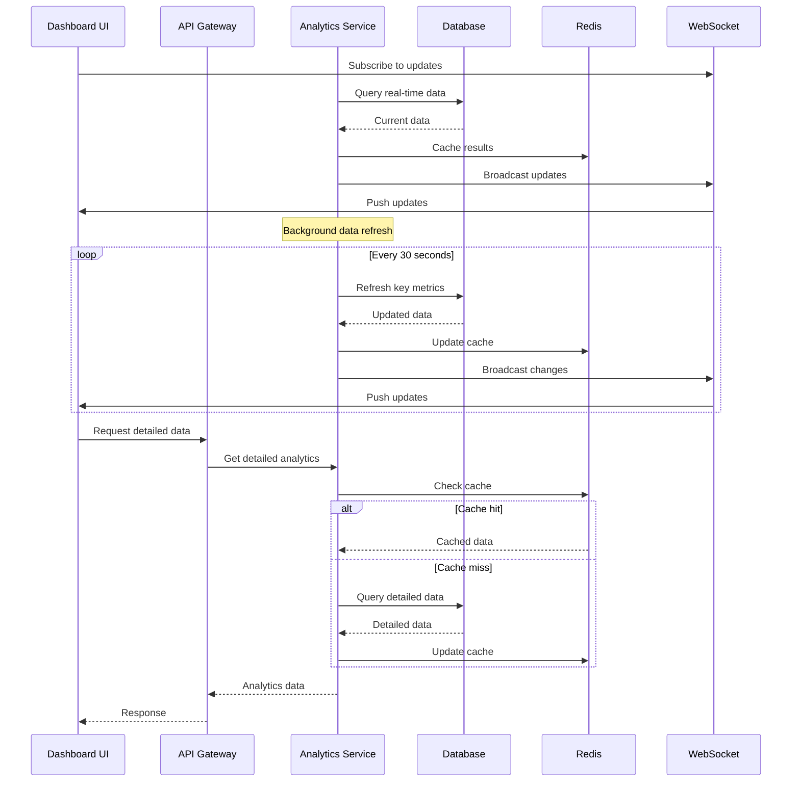
```mermaid
sequenceDiagram
    participant UI as Dashboard UI
    participant API as API Gateway
    participant Service as Analytics Service
    participant DB as Database
    participant Cache as Redis
    participant WS as WebSocket
    
    UI->>WS: Subscribe to updates
    Service->>DB: Query real-time data
    DB-->>Service: Current data
    Service->>Cache: Cache results
    Service->>WS: Broadcast updates
    WS->>UI: Push updates
    
    Note over Service: Background data refresh
    loop Every 30 seconds
        Service->>DB: Refresh key metrics
        DB-->>Service: Updated data
        Service->>Cache: Update cache
        Service->>WS: Broadcast changes
        WS->>UI: Push updates
    end
    
    UI->>API: Request detailed data
    API->>Service: Get detailed analytics
    Service->>Cache: Check cache
    alt Cache hit
        Cache-->>Service: Cached data
    else Cache miss
        Service->>DB: Query detailed data
        DB-->>Service: Detailed data
        Service->>Cache: Update cache
    end
    Service-->>API: Analytics data
    API-->>UI: Response
```

---

## 🔄 Data Flow Diagrams

### **Overall Data Flow Architecture**

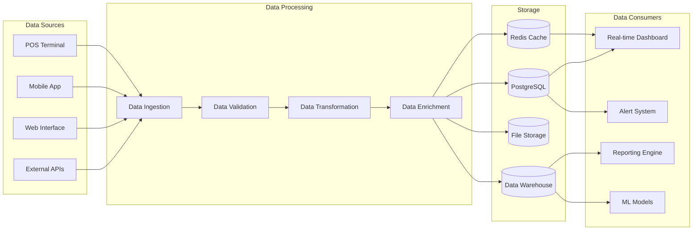
```mermaid
graph LR
    subgraph "Data Sources"
        POS[POS Terminal]
        Mobile[Mobile App]
        Web[Web Interface]
        API[External APIs]
    end
    
    subgraph "Data Processing"
        Ingest[Data Ingestion]
        Validation[Data Validation]
        Transform[Data Transformation]
        Enrich[Data Enrichment]
    end
    
    subgraph "Storage"
        Cache[(Redis Cache)]
        Transactional[(PostgreSQL)]
        Analytical[(Data Warehouse)]
        Files[(File Storage)]
    end
    
    subgraph "Data Consumers"
        Dashboard[Real-time Dashboard]
        Reports[Reporting Engine]
        Alerts[Alert System]
        ML[ML Models]
    end
    
    POS --> Ingest
    Mobile --> Ingest
    Web --> Ingest
    API --> Ingest
    
    Ingest --> Validation
    Validation --> Transform
    Transform --> Enrich
    
    Enrich --> Cache
    Enrich --> Transactional
    Enrich --> Files
    Enrich --> Analytical
    
    Cache --> Dashboard
    Transactional --> Dashboard
    Analytical --> Reports
    Transactional --> Alerts
    Analytical --> ML
```

### **Transaction Data Flow**

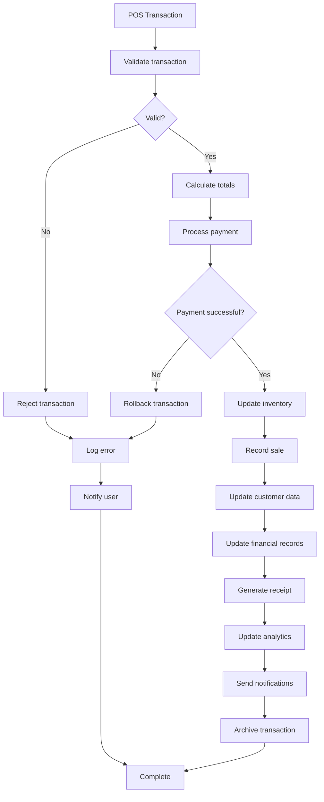
```mermaid
flowchart TD
    A[POS Transaction] --> B[Validate transaction]
    B --> C{Valid?}
    C -->|No| D[Reject transaction]
    C -->|Yes| E[Calculate totals]
    E --> F[Process payment]
    F --> G{Payment successful?}
    G -->|No| H[Rollback transaction]
    G -->|Yes| I[Update inventory]
    I --> J[Record sale]
    J --> K[Update customer data]
    K --> L[Update financial records]
    L --> M[Generate receipt]
    M --> N[Update analytics]
    N --> O[Send notifications]
    O --> P[Archive transaction]
    
    D --> Q[Log error]
    H --> Q
    Q --> R[Notify user]
    P --> S[Complete]
    R --> S
```

---

## ⚠️ Error Handling Flows

### **API Error Handling Flow**

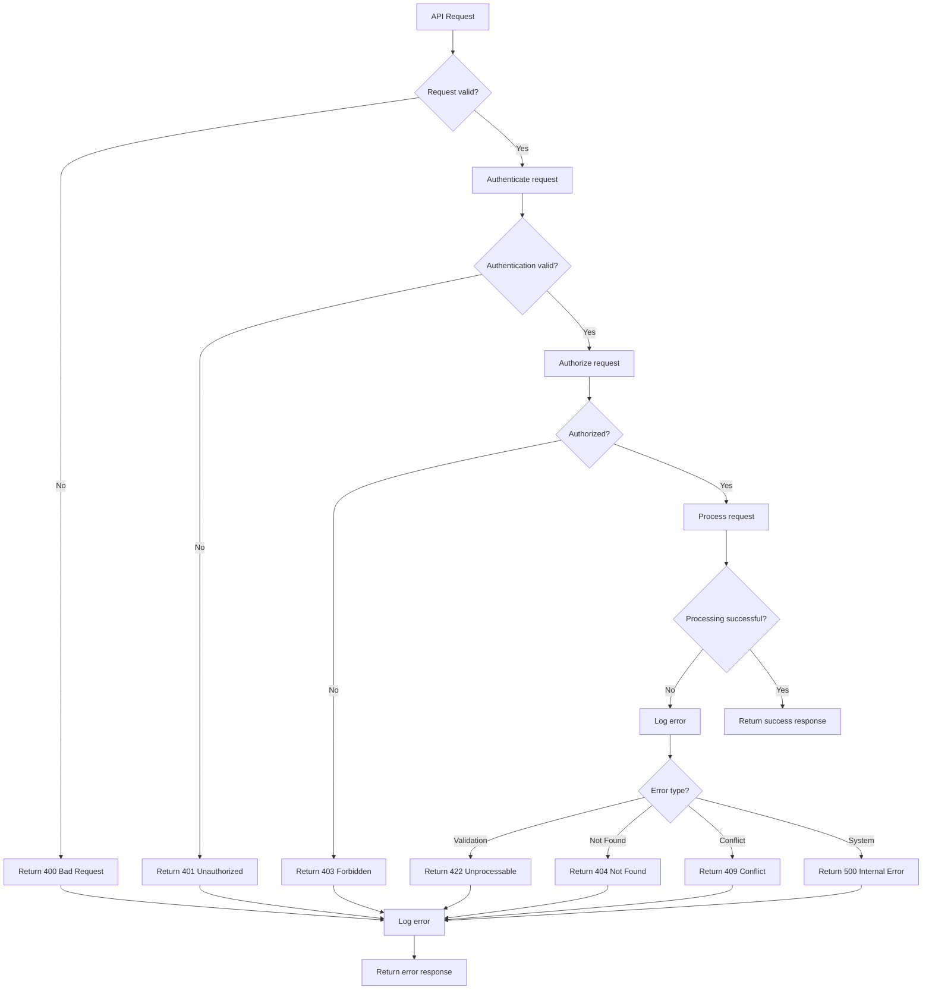
```mermaid
flowchart TD
    A[API Request] --> B{Request valid?}
    B -->|No| C[Return 400 Bad Request]
    B -->|Yes| D[Authenticate request]
    D --> E{Authentication valid?}
    E -->|No| F[Return 401 Unauthorized]
    E -->|Yes| G[Authorize request]
    G --> H{Authorized?}
    H -->|No| I[Return 403 Forbidden]
    H -->|Yes| J[Process request]
    J --> K{Processing successful?}
    K -->|No| L[Log error]
    K -->|Yes| M[Return success response]
    
    L --> N{Error type?}
    N -->|Validation| O[Return 422 Unprocessable]
    N -->|Not Found| P[Return 404 Not Found]
    N -->|Conflict| Q[Return 409 Conflict]
    N -->|System| R[Return 500 Internal Error]
    
    C --> S[Log error]
    F --> S
    I --> S
    O --> S
    P --> S
    Q --> S
    R --> S
    S --> T[Return error response]
```

### **Offline Mode Handling Flow**

```mermaid
sequenceDiagram
    participant POS as POS Terminal
    participant Local as Local Storage
    participant Sync as Sync Service
    participant Server as Server
    
    POS->>Local: Check connectivity
    Local-->>POS: Offline mode
    
    POS->>Local: Create transaction
    Local->>Local: Store in queue
    POS->>Local: Update local inventory
    Local-->>POS: Transaction complete
    
    Note over POS: Periodic connectivity check
    loop Every 30 seconds
        POS->>Local: Check connectivity
        Local-->>POS: Still offline
    end
    
    POS->>Local: Connectivity restored
    Local->>Sync: Start sync process
    Sync->>Server: Sync queued transactions
    Server-->>Sync: Confirm sync
    Sync->>Local: Clear synced items
    Sync->>Local: Update server data
    Local-->>POS: Sync complete
```

---

## 🔗 Integration Flows

### **Payment Gateway Integration Flow**

```mermaid
flowchart TD
    A[Initiate payment] --> B{Payment method}
    B -->|Card| C[Card payment flow]
    B -->|QRIS| D[QRIS payment flow]
    B -->|E-wallet| E[E-wallet flow]
    
    C --> F[Encrypt card data]
    F --> G[Send to payment gateway]
    G --> H{Gateway response}
    H -->|Success| I[Record payment]
    H -->|Failed| J[Retry payment]
    H -->|Error| K[Handle error]
    
    D --> L[Generate QR code]
    L --> M[Display QR to customer]
    M --> N[Wait for payment]
    N --> O{Payment received?}
    O -->|No| P[Check timeout]
    O -->|Yes| I
    P --> Q{Timeout?}
    Q -->|No| N
    Q -->|Yes| K
    
    E --> R[Redirect to e-wallet]
    R --> S[Wait for callback]
    S --> T{Callback received?}
    T -->|No| U[Check status manually]
    T -->|Yes| V{Payment successful?}
    V -->|No| K
    V -->|Yes| I
    
    I --> W[Update transaction status]
    W --> X[Send receipt]
    J --> C
    K --> Y[Show error message]
    U --> S
```

### **Email/SMS Notification Flow**

```mermaid
sequenceDiagram
    participant System as System
    participant Queue as Message Queue
    participant Email as Email Service
    participant SMS as SMS Service
    participant User as User
    
    System->>Queue: Queue notification
    Queue->>Queue: Prioritize message
    
    alt Email notification
        Queue->>Email: Send email
        Email->>User: Deliver email
        Email-->>Queue: Delivery status
        Queue-->>System: Update notification status
    else SMS notification
        Queue->>SMS: Send SMS
        SMS->>User: Deliver SMS
        SMS-->>Queue: Delivery status
        Queue-->>System: Update notification status
    end
    
    alt Delivery failed
        Queue->>Queue: Schedule retry
        Queue->>Queue: Check retry limit
        alt Retry limit not reached
            Queue->>Queue: Wait for retry interval
            Queue->>Email/SMS: Retry delivery
        else Retry limit reached
            Queue->>System: Mark as failed
            System->>System: Log failure
            System->>System: Notify admin
        end
    end
```

---

## 📈 Performance Monitoring Flow

### **System Performance Monitoring**

```mermaid
flowchart TD
    A[Application Running] --> B[Collect metrics]
    B --> C[CPU usage]
    B --> D[Memory usage]
    B --> E[Database performance]
    B --> F[API response times]
    B --> G[Error rates]
    
    C --> H[Send to monitoring]
    D --> H
    E --> H
    F --> H
    G --> H
    
    H --> I[Analyze metrics]
    I --> J{Threshold exceeded?}
    J -->|No| K[Continue monitoring]
    J -->|Yes| L[Trigger alert]
    L --> M{Alert type}
    M -->|Performance| N[Scale resources]
    M -->|Error| O[Notify developers]
    M -->|Critical| P[Emergency response]
    
    N --> Q[Auto-scale up]
    Q --> R[Monitor improvement]
    R --> S{Performance improved?}
    S -->|No| T[Manual intervention]
    S -->|Yes| K
    
    O --> U[Create incident]
    P --> V[Immediate response]
    
    K --> B
    T --> W[Resolve manually]
    V --> X[Investigate issue]
    W --> K
    X --> Y[Apply fix]
    Y --> K
```

---

## 🔄 State Management Flow

### **Frontend State Management Flow**

```mermaid
sequenceDiagram
    participant UI as UI Component
    participant Store as State Store
    participant API as API Client
    participant Cache as Local Cache
    participant Server as Server
    
    UI->>Store: Dispatch action
    Store->>Cache: Check local cache
    alt Cache hit
        Cache-->>Store: Return cached data
        Store-->>UI: Update UI
    else Cache miss
        Store->>API: Make API call
        API->>Server: Request data
        Server-->>API: Response data
        API-->>Store: Process response
        Store->>Cache: Update cache
        Store-->>UI: Update UI
    end
    
    Note over Store: Background sync
    loop Every 5 minutes
        Store->>API: Sync latest data
        API->>Server: Request updates
        Server-->>API: Updated data
        API-->>Store: Process updates
        Store->>Cache: Update cache
        Store-->>UI: Update UI if needed
    end
```

---

## 🎯 Key Decision Points in Application Flow

### **Critical Decision Flows**

```mermaid
flowchart TD
    A[User Action] --> B{Requires authentication?}
    B -->|No| C[Process directly]
    B -->|Yes| D{User authenticated?}
    D -->|No| E[Redirect to login]
    D -->|Yes| F{Has permission?}
    F -->|No| G[Show access denied]
    F -->|Yes| H{Online/Offline?}
    H -->|Offline| I[Queue for sync]
    H -->|Online| J{Data available locally?}
    J -->|No| K[Fetch from server]
    J -->|Yes| L[Use local data]
    K --> M{Server response?}
    M -->|Success| N[Update local cache]
    M -->|Error| O[Fallback to local]
    L --> P[Process action]
    N --> P
    O --> P
    I --> P
    C --> P
    P --> Q{Action successful?}
    Q -->|No| R[Rollback changes]
    Q -->|Yes| S[Update state]
    S --> T[Notify user]
    R --> U[Show error]
    E --> V[Show login]
    G --> W[Log security event]
```

---

**This comprehensive flowchart documentation provides a complete visual representation of all StoreWise application flows, ensuring clear understanding of system behavior and facilitating development, testing, and maintenance processes.**